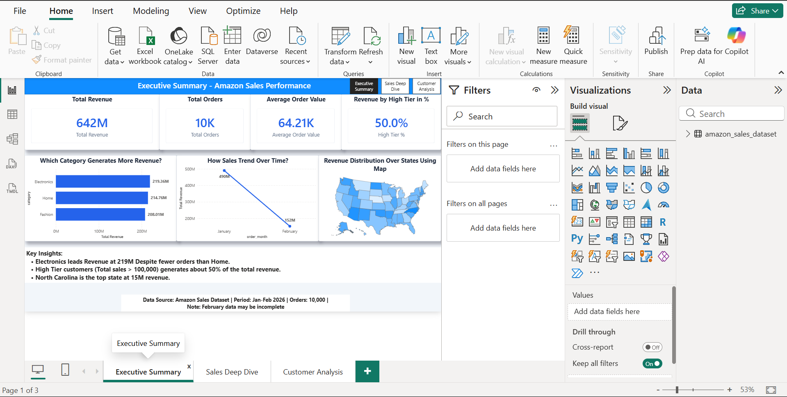
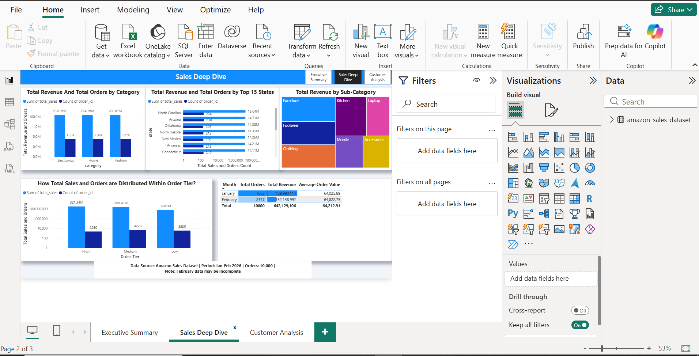
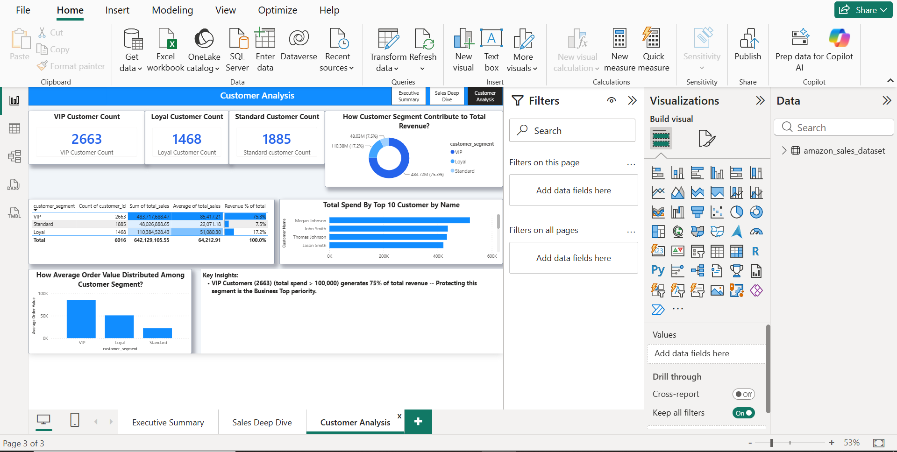

# Data Analytics Portfolio
## Murad Akhtar

## About
Aspiring Data Analyst skilled in Excel and SQL.
Building a portfolio of real-world business analysis 
projects through a structured 30-day analytics curriculum.
Currently learning Power BI and Python.

**Core Skills:** Excel | SQL | Data Cleaning | 
Pivot Tables | Window Functions | CTEs

---

## Project 1 — Amazon E-Commerce Sales Analysis
**Tool:** Microsoft Excel  
**Dataset:** 10,000 Amazon sales orders 
(January–February 2026)  
**Categories:** Electronics, Home, Fashion  
**US States covered:** 50  

### Key Findings
- Total revenue: 642,129,105 across 10,000 orders
- Average order value: 64,212 per order
- Electronics is the highest revenue category at 219,356,274 
  despite having fewer orders than Home (3,352 vs 3,379) — 
  indicating higher spend per transaction
- High-tier customers (orders above 100,000) represent 
  22.5% of orders but generate 50% of total revenue
- January revenue (489,990,113) was significantly higher 
  than February (152,138,991) — likely due to 
  incomplete February data
- North Carolina is the highest revenue state 
  at 15,037,672
- Data quality verified: no missing values, 
  no duplicates found across all 21 columns
- 163 statistical outliers identified via IQR analysis 
  and retained as legitimate high-value orders

### Skills Demonstrated
Data cleaning and audit logging, VLOOKUP, nested IF, 
SUMIF, COUNTIF, TEXT functions, pivot tables, 
exploratory data analysis, business memo writing 
using SCR framework

---

## Project 2 — Amazon E-Commerce SQL Analysis
**Tool:** SQL (SQLite)  
**Dataset:** Same 10,000 order dataset  
**Techniques:** JOINs, Window Functions, 
CTEs, CASE WHEN, LAG, DENSE_RANK  

### Key Findings

**Customer Analysis**
- VIP customers (2,663) generate 75% of total revenue 
  at 483,717,688 — highest priority retention segment
- Top 10% of customers (602) generate 27.14% of revenue, 
  spending 3.35x more per capita than remaining 90%
- Top 10% average lifetime value: 289,528 
  vs 86,412 for remaining 90%

**Product Analysis**
- Revenue is highly fragmented — no single blockbuster 
  product exists
- Top products contribute only 0.11% to 0.12% 
  of their category total
- Top Electronics product (P901): 249,155 revenue
- Top Fashion product (P412): 240,143 revenue  
- Top Home product (P750): 248,605 revenue

**State Performance**
- Georgia and South Dakota show high order volumes 
  (189–190 orders) but below-average order values 
  of 61,000–62,000
- Massachusetts outperforms with 189 orders 
  at 73,477 average order value
- California leads all states in total revenue

**SQL Techniques Used**
- Multi-table JOINs (3 tables simultaneously)
- Window functions: ROW_NUMBER, DENSE_RANK, 
  LAG, SUM OVER, AVG OVER
- CTE chains up to 3 steps deep
- CASE WHEN for customer and order segmentation
- NTILE for customer decile analysis
- Diagnosed and resolved JOIN explosion caused 
  by non-unique product_id keys

### Strategic Recommendation
Launch a dedicated VIP retention program targeting 
the 602 highest-value customers who drive over 
a quarter of total business. Simultaneously lift 
average order values in high-volume low-yield states 
like Georgia and South Dakota through automated 
spending thresholds and tiered bundling incentives. 
Create high-ticket cross-category packages to drive 
larger transaction sizes across the entire customer base.

---

## Project 3 — Amazon Sales Power BI Report
**Tool:** Microsoft Power BI  
**Dataset:** Same 10,000 order dataset  
**Techniques:** DAX measures, Calculated columns, 
Live data refresh, Multi-page report design,
Map visualization, Treemap, Donut chart

### Report Structure
- Page 1: Executive Summary — headline KPIs for CEO
- Page 2: Sales Deep Dive — category, state, 
  product analysis for Sales Director  
- Page 3: Customer Analysis — segmentation 
  and retention priorities for Marketing Director

### Key Findings

**Sales Performance**
- Total revenue: 642M across 10,000 orders
- Electronics leads at 219M despite fewer orders 
  than Home (3,352 vs 3,379) — highest revenue 
  per transaction at 65,440 average
- January revenue (490M) vs February (152M) — 
  69% decline indicating incomplete February data
- North Carolina top state at 15M revenue

**Customer Segmentation**
- VIP customers (2,663) generate 75% of total 
  revenue at 483M — average spend 181,643 per customer
- Loyal segment (1,468 customers) generates 17% 
  at 110M — primary upgrade target
- Standard segment (1,885 customers) generates 
  only 7.5% despite being second largest group

**Product & Category**
- Revenue evenly distributed — no single 
  blockbuster product exists
- Top product contributes only 0.12% of 
  category total — highly fragmented catalog
- Sub-categories: Furniture and Kitchen lead 
  Home, Laptop and Mobile lead Electronics

### Strategic Recommendation
Retain the 2,663 VIP customers generating 75% 
of revenue through a dedicated retention program. 
Simultaneously run upgrade campaigns targeting 
the 1,468 Loyal customers — converting even 20% 
to VIP status would add approximately 22M in 
annual revenue. Focus Electronics acquisition 
to leverage its superior revenue per transaction.

### DAX Measures Built
- Total Revenue, Total Orders, Avg Order Value
- High Tier %, VIP Revenue, VIP Customer Count
- Revenue % of Total, January Sales, February Sales
- Customer Segment (calculated column)
- Order Tier (calculated column)

### Screenshots

---
## Core Skills Updated
**Excel** | **SQL** | **Power BI** | Python (learning)
